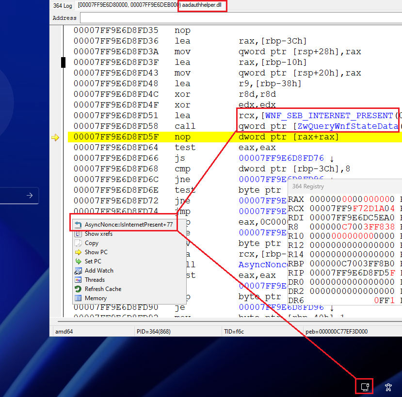

# Windows shows no internet access but my internet is working fine

this is well known problem if search in google. and no common solution, or even any solution or explain at all.
of course can be different reasons, why is this. because exist several ways how check internet present.
different applications can use different methods and got different results.
i try explain one case - reason and solution (how minimum temporary)

i also have the same problem in my windows several years. network icon is shown wrong internet status (no internet), despite it exist.
if kill/restart explorer - icon show correct status (for current time), but again fail view state changes.
however if task only in notification icon - this is minor problem. i, as developer, after fast research, understand that NetworkIcon.dll show this icon.
but it written with winrt, debug such code is.. ok

recently i check FIDO2 login with token. and got error 
"Your device is offline. Make sure your device is connected to the Internet"
this is already serious problem. not just a icon. so i begin research again. fortunately `aadauthhelper.dll` ( which do most processing and got this error ) much easy to debug
i fast found place

```
asyncnonce.cpp: AsyncNonce::IsInternetPresent
```



it call
```
static const WNF_STATE_NAME WNF_SEB_INTERNET_PRESENT = { 0xa3bc0875, 0x41840b3e };
ULONG64 Flags = 0;
ULONG cb;

WNF_CHANGE_STAMP ChangeStamp = 0;
NtQueryWnfStateData(&WNF_SEB_INTERNET_PRESENT, 0, 0, &ChangeStamp, &Flags, &(cb = sizeof(Flags)));
```
and `WNF_SEB_INTERNET_PRESENT` got wrong status

so who is must set and not set this state ?

interesting that when i try call this code, `NtQueryWnfStateData(&WNF_SEB_INTERNET_PRESENT`, from test exe, i got `STATUS_ACCESS_DENIED` error
but if i impersonate to 'NT AUTHORITY\SYSTEM', code executed ok
i check security descriptor for `WNF_SEB_INTERNET_PRESENT` and found next

```
NT AUTHORITY\SYSTEM - all access
NT SERVICE\netprofm - write access
NT SERVICE\RoutePolicy, NT SERVICE\DoSvc, NT SERVICE\wlpasvc - read access
APPLICATION PACKAGE AUTHORITY\ALL APPLICATION PACKAGES - read access
```

(interesting that app packages have read access, can query this state, when classic win32 apps have not)

from this already we have strong hint that `netprofm` must set `WNF_SEB_INTERNET_PRESENT`
i search in DLL for `WNF_SEB_INTERNET_PRESENT` and found that `netprofmsvc.dll` really set `WNF_SEB_INTERNET_PRESENT`

this was inside
```
void ConnectivityAggregator::PublishState(NLM_WNF_GLOBAL_CONNECTIVITY_STATE_DATA const &);
```
here several WNF was set:
```
WNF_NLM_GLOBAL_CONNECTIVITY_STATE
WNF_NLM_INTERNET_PRESENT
WNF_SEB_INTERNET_PRESENT
WNF_SEB_FREE_NETWORK_PRESENT
```
the `ConnectivityAggregator::PublishState` called from several places, but under condition. i set breakpoints and view - in my system `PublishState` not called. never, despite internet state is changed.
parent functions is called, on connectivy change event, but it not call `PublishState`.

after some research i understand that conditions related to windows firewall.
in `netprofmsvc.dll` exist thread
```
static unsigned long CImplINetworkListManager::FirewallEventMgrThreadProc(void *);
```
he is wait on some event, in infinite loop, and then, after event signaled, can call or
```
static void ConnectivityAggregator::OnFirewallNotReady();
```
or
```
static void ConnectivityAggregator::OnFirewallReadyAndStable()
```
and what i is need - call `ConnectivityAggregator::OnFirewallReadyAndStable()`, this call set correct conditions for call `ConnectivityAggregator::PublishState`
how is force call `ConnectivityAggregator::OnFirewallReadyAndStable()` ?
i found that `netprofmsvc.dll` itself check and subscribed for 
`WNF_WFAS_FIREWALL_NETWORK_CHANGE_READY`
when it set -
``` 
static long CImplINetworkListManager::_FirewallNetworkChangeReadyCallback(_WNF_STATE_NAME,unsigned long,_WNF_TYPE_ID *,void *,void const *,unsigned long);
```
must be called, which is call internal
```
static long CImplINetworkListManager::PostFirewallEventToFirewallEventMgr(NpFirewallEventType);
```
which SetEvent on which wait
```
static unsigned long CImplINetworkListManager::FirewallEventMgrThreadProc(void *);
```
and it called `ConnectivityAggregator::OnFirewallReadyAndStable()`

so who is set `WNF_WFAS_FIREWALL_NETWORK_CHANGE_READY` ?
after fast binary search, i found that this is `MPSSVC.DLL`
here exist such function
```
void FwDynDataPublishNetworkChangeReadyState(BOOL bReady)
{
	static const WNF_STATE_NAME WNF_WFAS_FIREWALL_NETWORK_CHANGE_READY = { 0xa3bc0875, 0x1287083a };
	RtlPublishWnfStateData(WNF_WFAS_FIREWALL_NETWORK_CHANGE_READY, 0, &bReady, sizeof(bReady), 0);
	//NtUpdateWnfStateData(&WNF_WFAS_FIREWALL_NETWORK_CHANGE_READY, &bReady, sizeof(bReady), 0, 0, 0, 0);
}
```
but i my system no any firewalls. i very strong hate them.
so nodobody of course called FwDynDataPublishNetworkChangeReadyState.
but in what problem write own service, which call 
`NtUpdateWnfStateData(&WNF_WFAS_FIREWALL_NETWORK_CHANGE_READY, &bReady, sizeof(bReady), 0, 0, 0, 0);`
?
of course task is absolute trivial. so i do this and - now FIDO2 device work and i view correct internet icon status on taskbar.
simply set this service as auto start and all. 

probably this will be not a solution for all such problems (may be some another service, including netprofm, not running in system, registry setting, etc)
but maybe for large part of cases


[explorer icon](https://youtu.be/7zh5wbO6SDo)
[fido2](https://youtu.be/jmpCCqfSjao)
